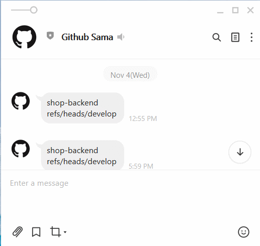

# notify-github-sama

As a web service that listen to the GitHub webhook for notifying Line users.

## Goal

- link github webhook
- notify message with Line

## Skill

- express
- [github-webhook-handler](https://www.npmjs.com/package/github-webhook-handler)
- [messaging-api-line](https://www.npmjs.com/package/messaging-api-line)

## Tips

- setup github webhook
    - Content type -> application/json
    - <domain_name>/webhook

- setup .env variable for Messaging API
    - ACCESS_TOKEN
    - CHANNEL_SECRET
    - USER_ID

## Result

